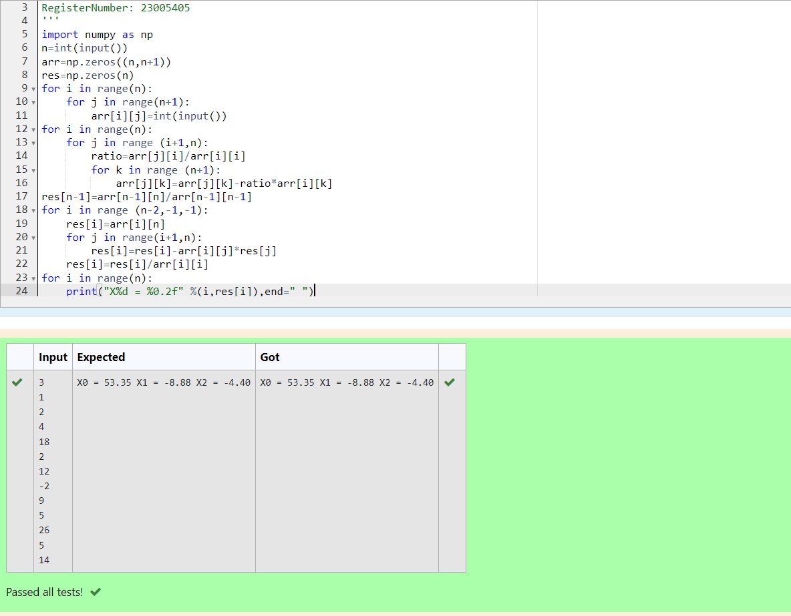

# Gaussian Elimination

## AIM:
To write a program to find the solution of a matrix using Gaussian Elimination.

## Equipments Required:
1. Hardware – PCs
2. Anaconda – Python 3.7 Installation / Moodle-Code Runner

## Algorithm
1. Import the numpy module to use the built in function for calculation 
2. Import the sys function. Get input from the user for the matrix i and j using for loop
3. Check wheather the matrix of element is divisible by zero . If divisible by zero then print zero is detected. 
4. End of the program

## Program:
```
'''Program to solve a matrix using Gaussian elimination without partial pivoting.
Developed by: Yamuna M
RegisterNumber: 23005405
'''
import numpy as np
n=int(input())
arr=np.zeros((n,n+1))
res=np.zeros(n)
for i in range(n):
    for j in range(n+1):
        arr[i][j]=int(input())
for i in range(n):
    for j in range (i+1,n):
        ratio=arr[j][i]/arr[i][i]
        for k in range (n+1):
            arr[j][k]=arr[j][k]-ratio*arr[i][k]
res[n-1]=arr[n-1][n]/arr[n-1][n-1]
for i in range (n-2,-1,-1):
    res[i]=arr[i][n]
    for j in range(i+1,n):
        res[i]=res[i]-arr[i][j]*res[j]
    res[i]=res[i]/arr[i][i]
for i in range(n):
    print("X%d = %0.2f" %(i,res[i]),end=" ")
```

## Output:



## Result:
Thus the program to find the solution of a matrix using Gaussian Elimination is written and verified using python programming.

